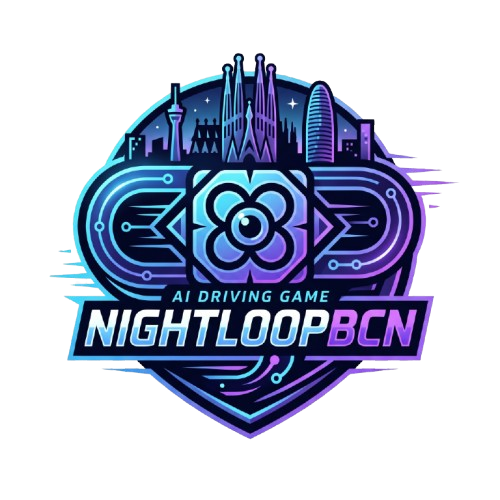
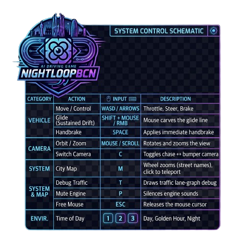

<p align="center"></p>

A night driving game built in Godot 4, set in real Barcelona. You load in,
roll out onto Carrer de l'Hort de la Vila, and drive — real streets from
OpenStreetMap, real street names on marble plaques, ambient traffic that
stops at real traffic lights.

## Run

```sh
cd godot
godot          # or open the folder in the Godot editor and press Play
```

First run after cloning: let the editor import the ~2,270 city tiles once.

## Controls
<p align="center"></p>

## What's inside

- **The city**: ~2,270 streamed OSM-derived tiles (roads, buildings, bridges,
  tunnels) with collision, textured ground (asphalt / sidewalk paving /
  park grass / bike lanes classified from OSM + the lane graph), procedural
  facade windows, streetlight field, and street-name plaques from real OSM
  data.
- **Ambient traffic**: an offline SUMO-built lane graph (230k lanes, 2,344
  signal programs) driven by an IDM kinematic sim — cars, vans and trucks;
  the nearest promote to full vehicle physics.
- **The map**: a GTA-style minimap plus a full city map (`M`) with street
  names and click-to-teleport.
- **The car**: arcade drift physics ported from the original NightLoop demo,
  with the classic muscle-car model and crash audio.

Tooling lives in `godot/tools/` (lane-graph builder, street-name baker).
`godot/PORT.md` tracks engineering history and the roadmap.

## Data & licenses

Map data **© OpenStreetMap contributors (ODbL)** — attribution is shown
in-game. All vendored assets and their licenses: [`ASSETS.md`](ASSETS.md).

Derived data is not committed (the full-city lane graph alone exceeds
GitHub's file-size limit). After dropping the tile data, rebuild it from
`godot/`:

```sh
python3 tools/build_lane_graph.py --bbox full   # traffic lane graph
python3 tools/bake_ground_masks.py              # ground classification masks
python3 tools/bake_city_map.py                  # M-map texture (committed)
```

The original NightLoop WebGL demo lives on in the
[NightLoop](https://github.com/davidlahoz/NightLoop) repository.
